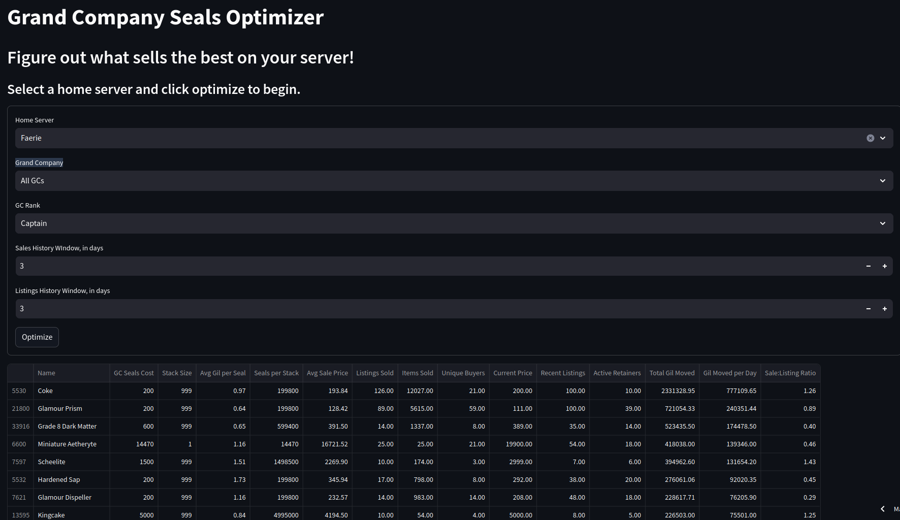

# gc_seals_opti
App for optimizing XIV GC seal usage via universalis API

Hosted at [https://gcsealsopti.streamlit.app/](https://gcsealsopti.streamlit.app/)! You may need to wait for the app to boot, and I can't turn telemetry and tracking off. Snowflake owns Streamlit.

Local deployment is just `streamlit run interface.py` in the dir. `proto.ipynb` is a scratchpad and should take it out of main. You can safely delete it. 

Other Caveats: 
* There may not be anything good on your server
* Materiel boxes are too volatile and have been excluded
* This app is in maintenence mode, none of the things it shows are particularly surprising
* The code is atrocious. I will not be fixing it here because I'm overhauling it for another project
